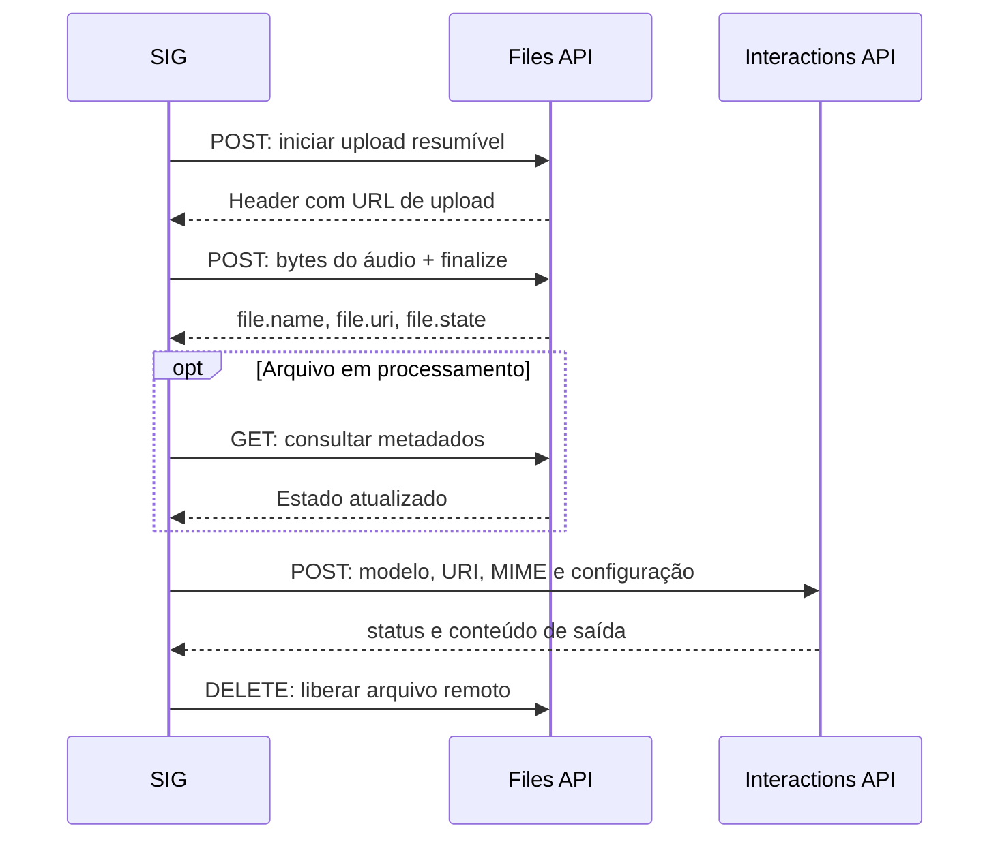

# Informativo técnico: Gemini 3.5 Transcribe por REST e WebSocket

**Data de revisão: 10/10/2026.** Este documento descreve as requisições da
Gemini Developer API e os cuidados adotados na integração do SIG Windows.
Todos os valores de arquivos, textos e identificadores dos exemplos são ilustrativos.
Nenhuma chave real está incluída.

## 1. Qual modelo e qual transporte utilizar

| Aspecto | REST: arquivos | WebSocket: áudio ao vivo |
| --- | --- | --- |
| Modelo | `gemini-3.5-transcribe` | `gemini-3.5-transcribe-live` |
| Nome no setup | Não se aplica | `models/gemini-3.5-transcribe-live` |
| Serviço | Files API + Interactions API | Live API |
| Entrada no SIG | Arquivo de áudio completo | PCM do microfone em blocos |
| Entrega do texto | Resposta à requisição de transcrição | Mensagens parciais e finais durante a sessão |
| Identificação de falantes | Disponível no REST | Indisponível no Live |
| Timestamps por palavra | Disponíveis no REST | Indisponíveis no Live |
| Duração | Até 1 hora; 30 minutos com diarização ou timestamps | Até 10 minutos por sessão |

Esses modelos são específicos de transcrição. Os limites e recursos acima
estão na [ficha oficial do Gemini 3.5 Transcribe](https://ai.google.dev/gemini-api/docs/models/gemini-3.5-transcribe).

No SIG Windows, o microfone branco grava para envio REST; o verde usa
WebSocket. A ferramenta Transcrição envia cada arquivo por REST. O lote do
SIG é uma fila de chamadas individuais; não utiliza a Batch API do Google.

## 2. Autenticação

A autenticação deste fluxo usa uma chave da Gemini Developer API, configurada
no campo **G AI Studio** do SIG. Nas chamadas HTTP, envie:

```http
x-goog-api-key: <CHAVE_OBTIDA_EM_TEMPO_DE_EXECUCAO>
```

A [documentação de chaves da Gemini API](https://ai.google.dev/gemini-api/docs/api-key)
explica a criação e as restrições das chaves. A chave deve ter acesso ao
serviço e aos modelos utilizados. Cobrança e quotas pertencem ao projeto associado.

Na conexão WebSocket do SIG, esse mesmo header é enviado no handshake HTTPS.
**Esse uso do header foi validado nos testes reais do projeto.** Exemplos do
Google também mostram autenticação por `?key=...` na URL. O SIG usa o header
para manter a chave fora da URL registrada em diagnósticos.

Os exemplos Python abaixo leem `GEMINI_API_KEY` do ambiente. Configure essa
variável na sessão de execução sem escrever a chave no código ou nos logs.

## 3. REST: sequência completa



O upload disponibiliza o áudio; a transcrição acontece na chamada posterior
à Interactions API. Os passos de upload seguem a
[documentação da Files API](https://ai.google.dev/gemini-api/docs/files).

### 3.1 Iniciar o upload

```http
POST https://generativelanguage.googleapis.com/upload/v1beta/files
x-goog-api-key: <CHAVE>
Content-Type: application/json
X-Goog-Upload-Protocol: resumable
X-Goog-Upload-Command: start
X-Goog-Upload-Header-Content-Type: audio/wav
X-Goog-Upload-Header-Content-Length: <TAMANHO_DO_ARQUIVO_EM_BYTES>
```

Corpo:

```json
{
  "file": {
    "display_name": "SIG transcription"
  }
}
```

Leia o header `X-Goog-Upload-URL` da resposta. Ele contém a URL que deve
receber os bytes. Nomes de headers HTTP não diferenciam maiúsculas de minúsculas.

`X-Goog-Upload-Header-Content-Length` é o tamanho do **áudio**, enquanto o
`Content-Length` desta primeira requisição, se montado manualmente, é o tamanho
do **JSON de metadados**.

### 3.2 Enviar os bytes e finalizar o upload

```http
POST <URL_RECEBIDA_NO_HEADER_X_GOOG_UPLOAD_URL>
x-goog-api-key: <CHAVE>
Content-Type: audio/wav
Content-Length: <TAMANHO_DO_ARQUIVO_EM_BYTES>
X-Goog-Upload-Offset: 0
X-Goog-Upload-Command: upload, finalize
```

O corpo é o conteúdo binário do arquivo. No SIG, a transmissão usa blocos
de 128 KiB para permitir cancelamento durante o envio.

Exemplo simplificado da resposta:

```json
{
  "file": {
    "name": "files/arquivo-exemplo",
    "uri": "https://generativelanguage.googleapis.com/v1beta/files/arquivo-exemplo",
    "mimeType": "audio/wav",
    "state": "ACTIVE"
  }
}
```

Use os identificadores efetivamente recebidos. O exemplo acima não representa
um arquivo acessível. O SIG também valida o domínio da URL de upload antes
de encaminhar sua chave.

### 3.3 Consultar o processamento, quando necessário

Se o estado for `PROCESSING`, consulte os metadados até o arquivo ficar pronto:

```http
GET https://generativelanguage.googleapis.com/v1beta/files/<IDENTIFICADOR>
x-goog-api-key: <CHAVE>
```

Um estado `FAILED` interrompe a operação. No SIG, o intervalo de consulta é
0,5 segundo e o prazo de preparação é 180 segundos. Esses tempos são escolhas
do cliente. Os recursos GET e DELETE estão na
[referência de arquivos](https://ai.google.dev/api/files).

### 3.4 Pedir a transcrição

```http
POST https://generativelanguage.googleapis.com/v1beta/interactions
x-goog-api-key: <CHAVE>
Content-Type: application/json
Accept: application/json
```

Corpo usado para português brasileiro e transcrição literal:

```json
{
  "model": "gemini-3.5-transcribe",
  "input": [
    {
      "type": "audio",
      "uri": "<FILE_URI_RECEBIDA_DO_UPLOAD>",
      "mime_type": "audio/wav"
    }
  ],
  "generation_config": {
    "transcription_config": {
      "language_codes": ["pt-BR"],
      "mode": {
        "type": "verbatim"
      }
    }
  },
  "store": false
}
```

`uri` referencia o áudio enviado. `mime_type` descreve o formato real do
arquivo. `store: false` solicita que a interação não seja armazenada como
interação persistente; isso não elimina o arquivo da Files API. O endpoint
e esse campo pertencem à [referência da Interactions API](https://ai.google.dev/api/interactions-api).

O SIG usa `/v1beta/`, que corresponde à versão beta dessa API. O corpo
dedicado de transcrição está no [guia REST do Google](https://ai.google.dev/gemini-api/docs/transcribe).

### 3.5 Ler somente a saída do modelo

A resposta real observada nos testes contém `steps`. Exemplo reduzido:

```json
{
  "id": "interacao-exemplo",
  "status": "completed",
  "steps": [
    {
      "type": "model_output",
      "content": [
        {
          "type": "text",
          "text": "O sistema está funcionando corretamente."
        }
      ]
    }
  ],
  "usage": {}
}
```

Procedimento de leitura:

1. Verificar sucesso HTTP e `status` da interação.
2. Percorrer `steps` e selecionar `type == "model_output"`.
3. Percorrer `content` e extrair os itens textuais.
4. Tratar `annotations` separadamente, quando presentes.

Não transforme todo o JSON em transcrição: identificadores, consumo e conteúdo
de entrada podem aparecer na resposta. O SDK pode expor `output_text` como
conveniência; o SIG normaliza o conteúdo recebido antes do parser geral.

### 3.6 Remover o arquivo remoto

```http
DELETE https://generativelanguage.googleapis.com/v1beta/files/<IDENTIFICADOR>
x-goog-api-key: <CHAVE>
```

O SIG tenta a exclusão no encerramento, inclusive após falha na transcrição.
A Files API documenta até 2 GB por arquivo, 20 GB por projeto e expiração em
48 horas. Isso é independente do limite de duração do modelo.
[Fonte: armazenamento de arquivos](https://ai.google.dev/gemini-api/docs/files).

## 4. Configurações REST: idioma, vocabulário e falantes

| Finalidade | Configuração dentro de `transcription_config` |
| --- | --- |
| Português brasileiro | `"language_codes": ["pt-BR"]` |
| Identificação automática | `"language_codes": []` |
| Mais de um idioma sugerido | Lista de locales suportados, como `["pt-BR", "en-US"]` |
| Termos específicos | `"custom_vocabulary": ["SIG", "Taguaí"]` |
| Texto literal | `"mode": {"type": "verbatim"}` |
| Texto tratado pelo modelo | `"mode": "smart"` |
| Identificação de falantes | `"diarization_mode": "speaker"` dentro do objeto `mode` |
| Tempos por palavra | `"timestamp_granularities": ["word"]` dentro do objeto `mode` |

Exemplo com identificação de falantes e tempos:

```json
{
  "language_codes": ["pt-BR"],
  "mode": {
    "type": "verbatim",
    "diarization_mode": "speaker",
    "timestamp_granularities": ["word"]
  }
}
```

As anotações `word_info` podem trazer `text`, `speaker`, `start_offset` e
`end_offset`. Os offsets são strings de duração, por exemplo `"0.100s"`.
O SIG converte os tempos para segundos e pode montar rótulos como
`Interlocutor 1` a partir dos identificadores de falante.

**Combinações:** `custom_vocabulary` não pode acompanhar diarização nem
timestamps. O modo `smart` também não combina com essas anotações. O modo
literal é o padrão adotado no SIG. Configurações e restrições estão no
[guia de transcrição](https://ai.google.dev/gemini-api/docs/transcribe).

O Google aceita até 1.000 termos e indica melhores resultados normalmente
com até 100. O SIG envia o perfil ativo de Keywords, com o limite próprio de
100 termos. Keywords favorecem grafias; não garantem que a palavra tenha sido dita.

## 5. WebSocket: endereço e handshake

Conecte em:

```text
wss://generativelanguage.googleapis.com/ws/google.ai.generativelanguage.v1beta.GenerativeService.BidiGenerateContent
```

No SIG, o handshake leva `x-goog-api-key`. Depois da conexão, envie primeiro
o setup. A estrutura geral da sessão está na
[referência WebSocket da Live API](https://ai.google.dev/api/live).

```json
{
  "setup": {
    "model": "models/gemini-3.5-transcribe-live",
    "generationConfig": {
      "responseModalities": ["TEXT"]
    },
    "inputAudioTranscription": {
      "languageCodes": ["pt-BR"],
      "mode": "VERBATIM"
    }
  }
}
```

Espere a confirmação antes de transmitir áudio:

```json
{"setupComplete": {}}
```

Os nomes no JSON WebSocket usam camelCase. Os campos de transcrição REST
mostrados antes usam snake_case. Preserve a grafia e as maiúsculas de cada
protocolo. O [guia de transcrição Live](https://ai.google.dev/gemini-api/docs/live-api/live-transcribe)
mostra o setup específico desse modelo.

## 6. Preparação e envio do áudio ao vivo

| Propriedade adotada no SIG | Valor |
| --- | --- |
| Representação | PCM sem cabeçalho de contêiner |
| Amostra | Inteiro de 16 bits, com sinal, little endian |
| Canais | 1, mono |
| Taxa | 16.000 amostras por segundo |
| MIME | `audio/pcm;rate=16000` |
| Bloco usual | 100 ms = 1.600 amostras = 3.200 bytes |

O cálculo é `16.000 × 2 bytes × 1 canal = 32.000 bytes/s`. Para produzir
um arquivo de demonstração a partir de outro áudio:

```powershell
.\dist\ffmpeg.exe -i entrada.wav -ac 1 -ar 16000 -c:a pcm_s16le -f s16le exemplo.pcm
```

A conversão cria PCM bruto. O comando é um exemplo para o binário distribuído
com o SIG. Um arquivo WAV contém cabeçalho; esse cabeçalho não integra as
amostras que vão para o streaming.

Cada bloco é codificado em base64 e enviado como mensagem JSON:

```json
{
  "realtimeInput": {
    "audio": {
      "data": "<BASE64_DOS_BYTES_PCM>",
      "mimeType": "audio/pcm;rate=16000"
    }
  }
}
```

O valor de `data` é a codificação dos bytes, não o caminho do arquivo.
O SIG mantém envio e recebimento em paralelo, permitindo receber rascunhos
enquanto o microfone continua produzindo áudio. O formato e a mensagem são
descritos no [guia Live](https://ai.google.dev/gemini-api/docs/live-api/live-transcribe).

## 7. Como interpretar as respostas WebSocket

Mensagens reais recebidas nos testes do SIG incluíram:

```json
{"serverContent":{"interimInputTranscription":{"text":"O sistema está"}}}
```

```json
{"serverContent":{"interimInputTranscription":{"text":"O sistema está funcionando"}}}
```

```json
{"serverContent":{"inputTranscription":{"text":"O sistema está funcionando corretamente."}}}
```

O rascunho representa a hipótese atual daquela fala. **Substitua o rascunho
anterior** a cada `interimInputTranscription`; não acrescente cada atualização
ao texto definitivo. Quando chegar `inputTranscription`, acrescente o texto
final e limpe o rascunho.

Estado recomendado do cliente:

```text
texto_confirmado = lista das falas finalizadas
rascunho = hipótese atual substituível
texto_exibido = texto_confirmado + rascunho
```

Duas falas iguais podem ser legítimas. Nos testes, ambas foram preservadas;
uma deduplicação global por texto apagaria a repetição realmente falada.

Também foram observados `generationComplete` e eventos `voiceActivity`
com `ACTIVITY_START`/`ACTIVITY_END`. Esses eventos ajudam a controlar a sessão;
o conteúdo de `inputTranscription` é a confirmação textual que o SIG utiliza.
O JSON recebido pode vir em frame binário contendo UTF-8, como aconteceu nos
testes. O receptor precisa decodificar esse JSON, além de aceitar frames textuais.

## 8. Encerramento normal e preservação da última frase

O sinal de fim do áudio é:

```json
{"realtimeInput":{"audioStreamEnd":true}}
```

Continue recebendo mensagens depois de enviá-lo. Fechar o socket na mesma
hora pode impedir a leitura da confirmação final. A mensagem de encerramento
faz parte do [protocolo Live](https://ai.google.dev/api/live).

### Ajustes implementados e testados no SIG

1. Interromper a produção de novas amostras do microfone.
2. Enviar os blocos que ainda estão na fila.
3. Enviar aproximadamente 2 segundos de PCM zerado, em blocos de 100 ms.
4. Enviar `audioStreamEnd`.
5. Continuar lendo as confirmações e verificar o estado da fala pendente.
6. Encerrar depois da consolidação, com uma margem de recebimento de 1 segundo.

**Os 2 segundos de silêncio são uma decisão do SIG, não uma exigência
documentada pelo Google.** Durante nossos testes ocorreram quedas com uma
última frase ainda pendente. O envio de silêncio antes do fim permitiu
receber a confirmação completa nos testes seguintes; isso não garante a
eliminação de toda falha de rede ou do serviço.

Se houver rascunho ou atividade pendente, o SIG aguarda confirmação por até
20 segundos após o sinal de fim. Ao falhar, preserva o áudio local e o texto
recebido. Uma sessão sem fala pode terminar sem produzir transcrição.

Parar e cancelar têm comportamentos diferentes: **parar** busca concluir o
texto; **cancelar** fecha a conexão para interromper a operação.

## 9. Pausa, renovação e tratamento da fila

Na pausa da captura principal Gemini, o SIG transmite PCM zerado para manter
o fluxo. As amostras captadas durante a pausa não entram na gravação local.

A sessão Live tem limite documentado de 10 minutos. O SIG inicia renovação
após aproximadamente 540 segundos e também reage a `goAway`: finaliza a fala
da sessão atual, abre outra conexão, repete o setup e envia o áudio pendente.
O limite pertence ao serviço; a margem de 9 minutos pertence ao cliente.
[Fonte: limites do modelo](https://ai.google.dev/gemini-api/docs/models/gemini-3.5-transcribe).

A captura principal usa fila de até 100 blocos. O cliente acelera o envio para
até 1,25 vez o ritmo normal quando há mais de 10 blocos aguardando, para
recuperar atraso de renovação. Se a fila principal lotar, interrompe a captura
e informa que o áudio foi preservado. Esses valores são parâmetros do SIG.

A implementação atual renova sessões previstas, mas não faz retomada
automática de uma conexão inesperadamente perdida. Reenviar uma fala inteira
sem controle dos trechos já confirmados pode duplicar texto.

## 10. Exemplos Python usando o cliente do projeto

Execute os exemplos a partir da raiz do SIG Windows, em um ambiente com as
dependências do projeto. São exemplos de chamada dos clientes existentes;
a implementação do transporte permanece em `src/gemini_stt_client.py`.

### 10.1 Arquivo por REST

```python
import os
import sys
import threading
from pathlib import Path

sys.path.insert(0, str(Path.cwd() / "src"))
from gemini_stt_client import GeminiTranscriptionUploader
from providers import GEMINI_STT_URL

settings = {
    "g_ai_studio_api_key": os.environ["GEMINI_API_KEY"],
    "gemini_language_mode": "pt-BR",
}
cancel = threading.Event()
client = GeminiTranscriptionUploader(cancel, settings)
status, parsed = client.post_file_parsed(
    GEMINI_STT_URL,
    Path("entrada.wav"),
    "audio/wav",
    Path("resposta-rest.raw"),
)
if status != 200:
    raise RuntimeError(f"Gemini retornou HTTP {status}")
print(parsed.text)
```

Esse cliente executa upload, consulta quando necessária, transcrição e
tentativa de exclusão. O arquivo `.raw` contém a resposta bruta da API;
trate-o como conteúdo de transcrição. O parâmetro de URL é mantido pelo
contrato de uploader do SIG, mas o cliente Gemini usa seu endpoint dedicado.

### 10.2 PCM por WebSocket

```python
import os
import queue
import sys
import threading
from pathlib import Path

sys.path.insert(0, str(Path.cwd() / "src"))
from gemini_stt_client import GeminiStreamingClient

settings = {
    "g_ai_studio_api_key": os.environ["GEMINI_API_KEY"],
    "gemini_language_mode": "pt-BR",
}
abort, stop = threading.Event(), threading.Event()
audio = queue.Queue(maxsize=100)
confirmed = []

def feed():
    try:
        with Path("exemplo.pcm").open("rb") as source:
            while not abort.is_set():
                chunk = source.read(3200)
                if not chunk:
                    break
                while not abort.is_set():
                    try:
                        audio.put(chunk, timeout=0.1)
                        break
                    except queue.Full:
                        continue
    finally:
        stop.set()

def receive(finals, draft):
    confirmed.extend(finals)
    print(" ".join(confirmed), "\nRascunho:", draft)

producer = threading.Thread(target=feed, daemon=True)
client = GeminiStreamingClient(settings, abort)
producer.start()
try:
    client.transcribe(audio, stop, receive, print)
finally:
    abort.set()
    client.cancel()
    producer.join(timeout=2)
```

O produtor lê amostras em blocos. O cliente estabelece a sessão, envia o setup,
controla o ritmo, recebe mensagens, acrescenta silêncio ao encerrar e renova
a conexão quando necessário. Em uma captura real, o microfone alimenta a fila.

## 11. Diagnóstico de erros

| Situação | Verificação prática |
| --- | --- |
| HTTP 400 | Conferir JSON, locale, MIME, combinações de vocabulário/diarização/timestamps e duração |
| HTTP 403 | Conferir chave, restrições, acesso ao serviço e projeto associado |
| HTTP 404 | Conferir endpoint, modelo e validade do identificador de arquivo |
| HTTP 429 | Conferir quota; controlar concorrência e frequência dos envios |
| HTTP 500 ou 503 | Registrar o erro redigido e tratar indisponibilidade do serviço |
| WebSocket cai antes do setup | Conferir handshake, autenticação e eventual mensagem/código de fechamento |
| Rascunhos se repetem na tela | Substituir hipóteses intermediárias, em vez de acumulá-las |
| Última frase fica pendente | Conferir fila, áudio de encerramento e recebimento após `audioStreamEnd` |
| Upload concluído sem texto | Conferir resultado da interação e extrair somente o conteúdo de saída |

Os códigos HTTP gerais são descritos no
[guia de diagnóstico do Google](https://ai.google.dev/gemini-api/docs/troubleshooting).
Uma queda WebSocket sem resposta HTTP útil exige observar os eventos já recebidos.

Para diagnosticar, registre etapa, status, duração, tamanho e erro com a chave
ocultada. Em caso de queda, mantenha separados o texto confirmado e a fala
pendente; eles têm níveis de confirmação diferentes.

## 12. O que foi comprovado no projeto

Os testes reais desta implementação usaram áudio sintético em português:

- REST com texto completo.
- REST com identificação de falante e timestamps.
- REST e WebSocket com vocabulário personalizado.
- WebSocket com rascunhos e confirmação final.
- Duas falas iguais preservadas.
- Renovação de sessões provocada durante o teste, mantendo as falas e
  esvaziando a fila de áudio.

Também passaram 355 testes de integração/regressão e uma execução final de
49 testes Gemini e de cópia dos parâmetros após a retirada do campo GCloud.
Os gates `syntax`, `ui-smoke` e a verificação do contexto de prompts passaram.
Na suíte completa, foram identificadas três falhas de layout de Diárias e
dois erros de fixtures do mapa de Diárias (campo `agencia` ausente). Os mesmos
resultados foram reproduzidos com o código anterior à integração Gemini;
esses pontos pertencem a outro escopo e foram preservados.
Essas provas verificam os cenários exercitados;
não constituem medição de precisão em todos os sotaques, ambientes ou gravações longas.

**Referência local de comportamento:** `src/gemini_stt_client.py`,
`src/stt_clients.py`, `src/providers.py` e a orquestração em `src/sig_app.py`.
Os exemplos deste documento descrevem o cliente Windows na data de revisão.


## 13. Integração no SIG Android

No projeto `D:\Projetos\SIG`, a chave é digitada no campo **Google AI Studio**
da tela **API KEYS**, pode ser revelada/ocultada e é gravada pelo `ApiKeyStore`
no armazenamento cifrado já usado pelo aplicativo. O importador aceita
`Google AI Studio`, `G AI Studio`, `Google AI Std` e `Gemini`.

Com uma chave preenchida no formato esperado, **Gemini 3.5 Transcribe** aparece
na seleção de modelos. A transcrição de arquivos e a gravação enviada como
arquivo usam REST; o microfone ao vivo da Ocorrência usa WebSocket.

Os contratos JSON ficam em `GeminiSttProtocol.kt`; `RemoteSttActivity.kt`
executa as chamadas e atualiza a interface. A implementação usa os mesmos
modelos, endpoints, autenticação e formatos de áudio descritos neste informativo.

O idioma é independente dos demais provedores: `pt-BR` por padrão, detecção
`multi`, `en-US`, `es-419` ou uma lista personalizada de códigos suportados.
A diarização está disponível no REST e desabilitada no Live. Keywords usam o
perfil ativo, com até 100 termos; no REST, combiná-las com diarização é
rejeitado antes do upload, com uma mensagem para desligar Keywords.

No Live, o Android aguarda `setupComplete`, aceita JSON em frames de texto ou
binários e usa PCM de 100 ms. A pausa envia silêncio. A renovação começa após
540 segundos ou ao receber `goAway`; até 100 frames de áudio ainda não enviados
ficam em uma fila durante a troca de sessão. Essa fila é esvaziada a 1,25 vezes
a velocidade de captura. Áudio já confirmado não é reenviado. Se uma conexão
cair inesperadamente, o intervalo sem conexão é indicado como `AUDIO_LOST`.

O encerramento envia dois segundos de silêncio e `audioStreamEnd`, mantém a
recepção da última fala e tem um limite total de 20 segundos. O handshake
inicial também tem limite de 20 segundos. Erros HTTP são apresentados pelo
status, sem copiar corpos de erro, headers ou credenciais para o diagnóstico.

Os testes reais com áudio sintético conferem o contrato da API a partir do
ambiente JVM do projeto Android. Eles não substituem a prova do microfone,
das permissões e do ciclo de vida da Activity em um aparelho Android.


### Validação da implementação Android

A suíte completa executou 657 casos: 655 aprovados e dois testes reais
condicionais ignorados nessa execução sem credencial. Os dois testes reais
foram executados separadamente no JVM com a chave temporária autorizada e
passaram, verificando a última frase no REST e no Live, além dos rascunhos
no Live. Nenhuma chave foi gravada nos fontes, relatórios ou APK.

Os gates `lintDebug` e `assembleDebug` passaram. O lint registrou zero erros
e 1134 avisos. O APK de depuração foi gerado em
`D:\Projetos\SIG\app\build\outputs\apk\debug\app-debug.apk`.
O mapa de módulos também passou. A prova de captura em aparelho Android
continua pendente; a validação real descrita aqui exercitou a API com uma
fixture sintética, sem acessar o microfone de um telefone.
